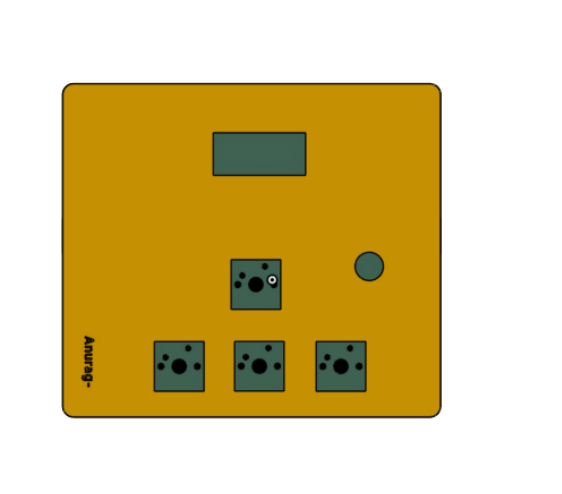
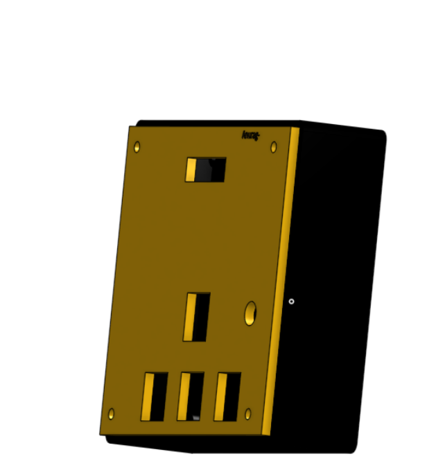
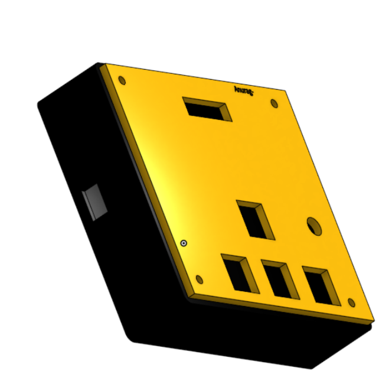
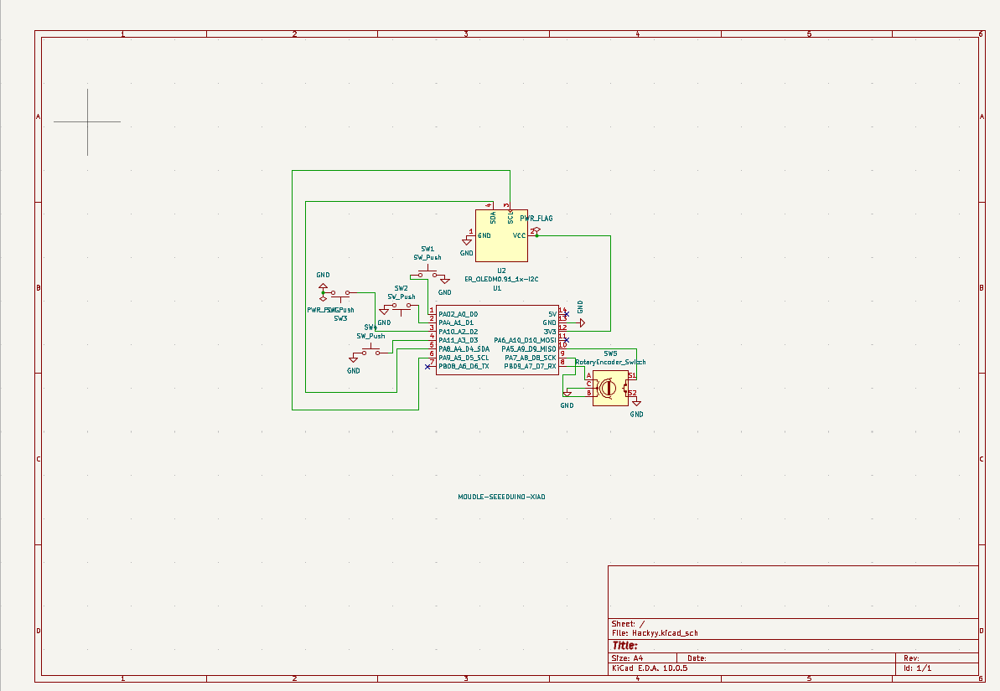
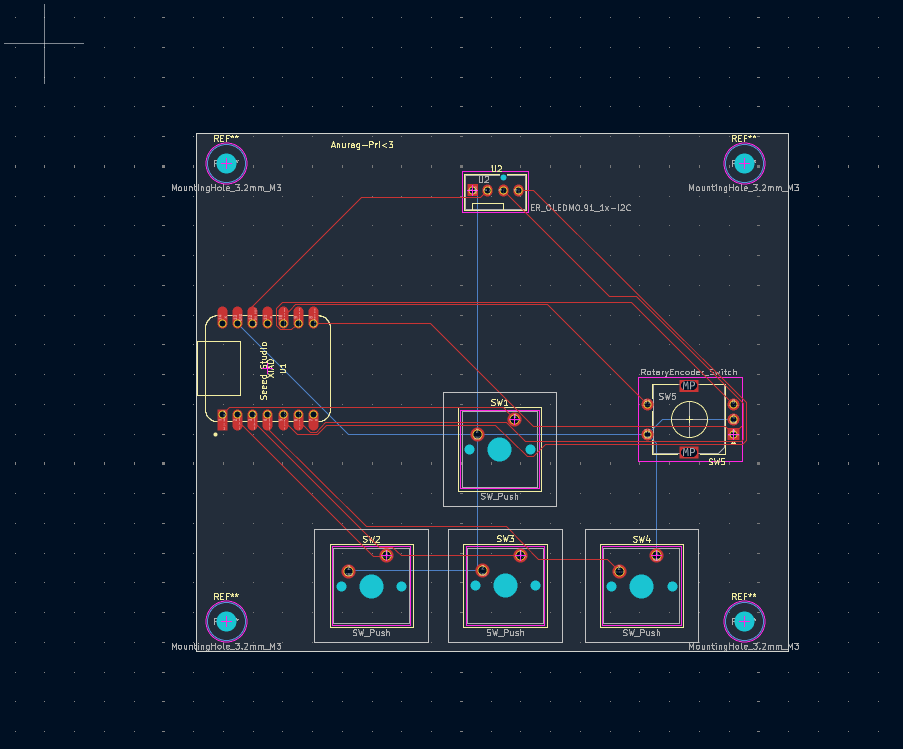

# Hackyy Pad

A custom 4-key macropad featuring a rotary encoder and an animated OLED display, designed and built from scratch for the Hack Club Stardance challenge.

---

## Screenshots

| Schematic | PCB Layout | 3D Case Design |
| :---: | :---: | :---: |
|  |  |  |

---

## Bill of Materials (BOM)

- **1x** Custom PCB (designed in KiCad)
- **1x** 3D Printed Enclosure (Top and Bottom halves)
- **1x** Seeed Studio XIAO RP2040 Microcontroller
- **4x** Mechanical Switches
- **4x** Keycaps
- **1x** Rotary Encoder + Knob
- **1x** 0.91" I2C OLED Display

---

## Layout & Workflow Shortcuts

I designed this pad as a dedicated desk companion to streamline deep-work sessions, audio control, and quick multitasking:

* **Rotary Encoder (Knob):** 
  * **Turn:** Smooth master volume adjustment
  * **Click:** Toggle Play / Pause media
* **Switch 1:** Quick system audio mute (lifesaver for surprise calls)
* **Switch 2:** Skip to next track
* **Switch 3:** Instant virtual desktop toggle (my dedicated "hide distractions / focus" button)
* **Switch 4:** Custom macro that automatically types out my Gumroad project link
* **OLED Display:** Runs a custom **Bongo Cat** animation that rapidly taps its paws along in real-time whenever I press a key or twist the knob!

---

## The Build Journey & What I Learned

### Hardware & Enclosure
- **KiCad PCB Design:** Routed the board around the Seeed Studio XIAO RP2040. Since it's a compact 4-key layout, I was able to skip the complexity of a traditional diode matrix and wired each switch directly from a GPIO pin to ground.
- **3D Modeling in Onshape:** Designed a custom two-part enclosure from scratch. The hardest part was dialing in the exact fit tolerances so the OLED glass, mechanical switch plate, and rotary encoder sat flush without flexing or rattling.

### Firmware & QMK
- **Directory Structure:** QMK was tough to configure at first. I learned the hard way that files can't just live anywhere—they have to follow strict nesting rules (`keyboards/hackyy_pad/keymaps/default`) for the build pipeline to compile.
- **Pin Mapping:** Translated physical schematic connections into digital pinouts inside `keyboard.json` to make sure the RP2040's GPIO lines synced up with the switch matrix.

### Pairing with AI as a Tutor
Rather than just copying and pasting blocks of code, I used AI as an interactive pair-programmer to:
- Learn core CAD constraints and modeling concepts in Onshape.
- Decode walls of cryptic red GCC compiler errors (like hunting down a rogue lowercase letter in an `enum` definition that brought down the whole build).
- Build the frame-swapping logic required to render the Bongo Cat bitmap without lagging key-input responsiveness.

---

## The 1.5-Hour Tragedy 😭

The most painful bug of this entire project had nothing to do with C code, trace routing, or 3D tolerances—it was time tracking.

I spent over an hour and a half deep in the zone writing firmware and debugging, only to discover that my **Hackatime** session had been logging to the completely wrong project on the Stardance dashboard. Over 1.5 hours of tracked work vanished into the void. But a end got the time back.

**Lesson learned:** Always double-check your active project before locking into a build sprint!